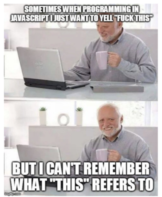
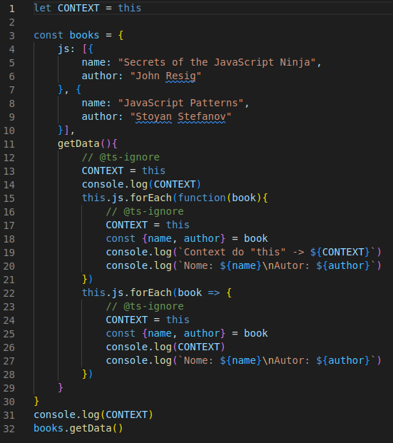
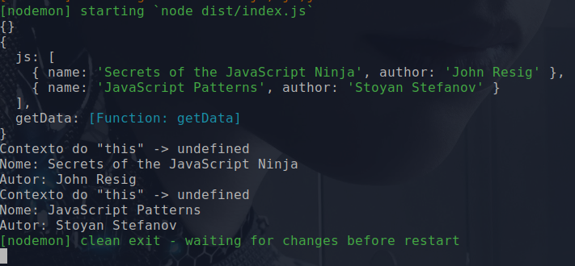
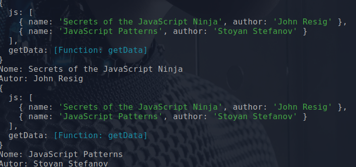
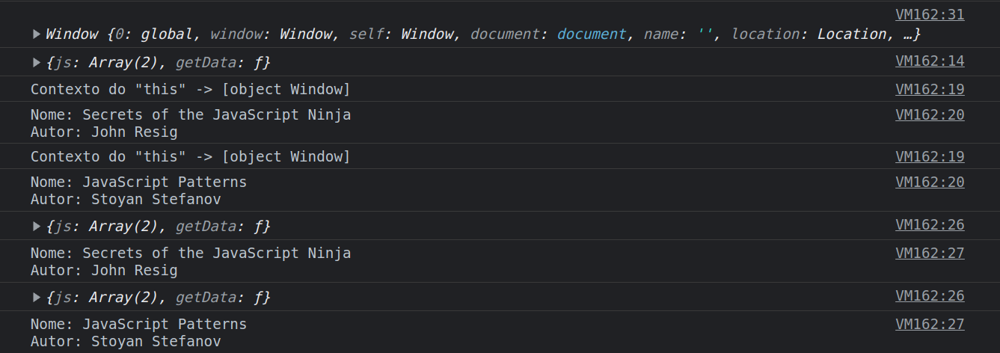

# JavaScript - "What the fuck this"

JavaScript por rodar em um ambiente super acessível, leia-se Browser. Na maioria das vezes é a porta de entrada para a programação e inicialmente cria-se uma curva de aprendizado muito baixo. Contudo não deixa de ter os por menores que existem comumente em outras linguagens.

E por incrível que pareça, são os programadores mais experientes que sofrem com as particularidades dessa linguagem. Principalmente aqueles com background Orientado Objeto muito enraizado.

<!--  -->

<div align="center">
    
</div>

Por isso resolvi contribuir com mais um artigo, dado ao vasto conteúdo e artigos sobre tais particularidades, assim reforço meu conhecimento e aprendizado nessa caminhada **"long life learning"**.

E um conceito simples que se torna muitas vezes uma dor de cabeça para quem vem pisar nas "terras firmes de hoje" do JavaScript, é o **ponteiro de this ou self**, dependendo da linguagem. Que basicamente aponta para instancia do objeto, o qual permite acessar propriedades e métodos do mesmo

<!-- ## Feature: this e seu contexto léxico -->

### E o contexto "this"? - "Sacou o duplo sentido" :sweat_smile: :expressionless:


<div align="center">
    
</div>

---

Uma vez que no JavaScript o **contexto de this** pode variar de acordo com a invocação/chamada de uma função ou método baseado no escopo e ambiente. Este artigo visa elucidar de forma simples mostrando cenários possíveis do mesmo.

### Exemplo

Foi declarado uma constante com nome de **"CONTEXT"** que referência o this, no entanto temos um objeto que representa uma entidade **"books"(livros)** que visa categorizar os livros por tipo. No caso específico, por tipos de linguaguem de programação.

Com isso podemos criar vários cenários para o **contexto "this"**.

__Código__:

<!--  -->
```
let CONTEXT = this

const books = {
    js: [{
        name: "Secrets of the JavaScript Ninja",
        author: "John Resig"
    }, {
        name: "JavaScript Patterns",
        author: "Stoyan Stefanov"
    }],
    getData(){
        // @ts-ignore
        CONTEXT = this
        console.log(CONTEXT)
        this.js.forEach(function(book){
            // @ts-ignore
            CONTEXT = this
            const {name, author} = book
            console.log(`Contexto do "this" -> ${CONTEXT}`)
            console.log(`Nome: ${name}\nAutor: ${author}`)
        })
        this.js.forEach(book => {
            // @ts-ignore
            CONTEXT = this
            const {name, author} = book
            console.log(CONTEXT)
            console.log(`Nome: ${name}\nAutor: ${author}`)
        })
    }
}
console.log(CONTEXT)
books.getData()
```

### Cenários:

1. __Callback__

    Callback é de uso comum no dia-a-dia do programador, porém aqui mora o perigo, pois somos surpreendido quando pensamos que o contexto de this seja de fato seu "contexto léxico", uma vez que funções também são objetos no JavaScript. Como assim? - Já explico!
    Foi por esse motivo que fiz questão de usar o `forEach` para percorrer a lista de livros da "categoria js". Veja: `this.js.forEach(book => {...`   

    O método forEach(callback) recebe um callback como parâmetro, onde normalmente passamos uma função anônima para tal, daí então a ligação de this é perdida. Veja o trecho abaixo:   

    __código__:

    ```
        getData(){
        // @ts-ignore
        CONTEXT = this
        console.log(CONTEXT)
        this.js.forEach(function(book){
            // @ts-ignore
            CONTEXT = this
            const {name, author} = book
            console.log(`Contexto do "this" -> ${CONTEXT}`)
            console.log(`Nome: ${name}\nAutor: ${author}`)
        })...
    ``` 

    Perceba que na linha x reatribuímos a variável CONTEXT o valor de this, que nesse caso, esperaríamos que aponta-se para referência do objeto **"books"(livros)**, mas nesse caso, temos a referência perdida.     

    __saída__:

       

    > __Observação__: Perceba que na saída temos um objeto vazio `{}`, em seguida temos já o objeto **"books"(livros)** com seus atributos/propriedade e métodos. E na sequencia os logs dentro do forEach. Logo mais exemplifico os dois(2) primeiros.

    __Voltando ao callback...__   

    É de conhecimento que temos atualmente três tipos de declaração de função em JavaScript. Sendo:

    * **Declaração de função**
    * **Expressão de função**
    * **Arrow function - função seta**

    E caso tenha observado na linha 22 do código, também foi percorrido a lista de livros, porém como callback do forEach passamos ao invés de uma função anonima uma **Arrow function**.   

    __Tá! E daí?__

    Quando declaramos uma **Arrow function** podemos ter em seu escopo o contexto de this da forma que se é esperado, uma vez que o **contexto léxico** dela atua de forma diferente comparado as outras duas formas, que no caso, é declaração de função e expressão de função.   

    __Como assim atua de forma diferente?__

    Entenda o this(forma didática) com sendo um estado que a função tem, porém esse estado pode muda de acordo com seu modo e contexto de invocação.

    __Não entendi!__

    Basicamente temos as três(3) formas mais comuns de se executar/invocar uma função. Sendo:

    1. Direta. Ex: minha-funcao()
    2. Como método. Ex: objeto.metodo()
    3. Como construtor. Ex: new funcao-construtora(...)

    Lembra que havia mencionado que o **contexto de this** pode variar baseado no escopo e ambiente?   

    Isso porque o **contexto de this** é **dinâmico**, ou seja, pode variar de acordo com contexto de invocação. Enquanto para a declaração do tipo **Arrow function**  é **estático**, ou seja, o valor de "this" não é alterado pelo contexto da invocação, porque ela guarda o contexto léxico no momento em que foi definida/declarada.

    Veja abaixo o escopo de this quando declarada como **Arrow function**:


    __saída__:

    

    Repare que antes de cada impressão dos dados do livro, temos o objeto **"books"(livros)** com seus atributos/propriedade e métodos.

    > __Observação__: É claro, que também podemos fazer uso do método bind(), do "objeto function", o qual passamos por parâmetro a referência de this no momento da invocação da mesma. Mas aí é uma artimanha da linguagem...     

    2. __Ambiente__

    Pois bem, o contexto de this, pode variar também de acordo com ambiente de execução. Abaixo os logs do mesmo código, porem executado no Browser.

    __saída__:

       

    Repare que enquanto no ambiente Node o primeiro log era um objeto vazio -> `{}`, porém no Browser temos um objeto Windows e o contexto de this não mais undefined e sim o Window -> "[object Window]". Contudo se vc estiver atento para os logs do escopo da **Arrow function**, o contexto this se comporta conforme esperado, apontando para  objeto **"books"(livros)**. 

